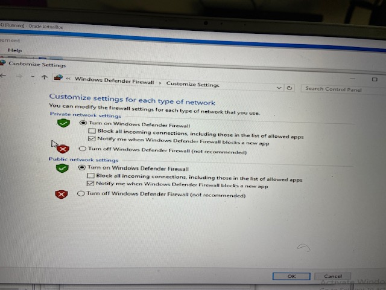
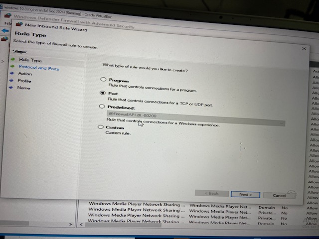
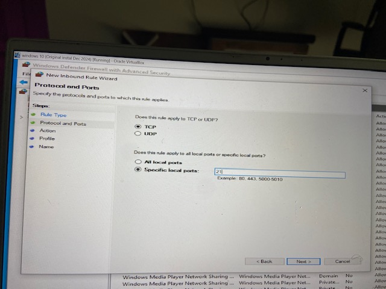
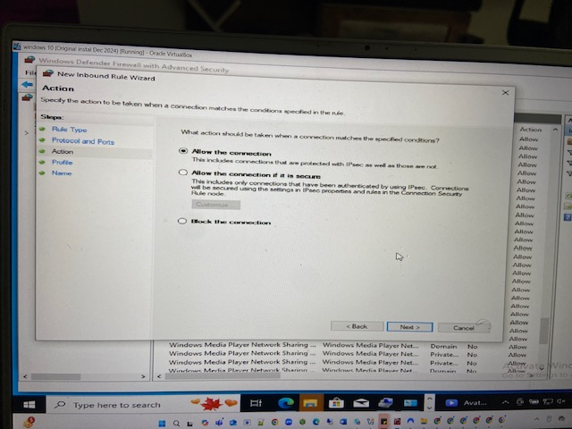
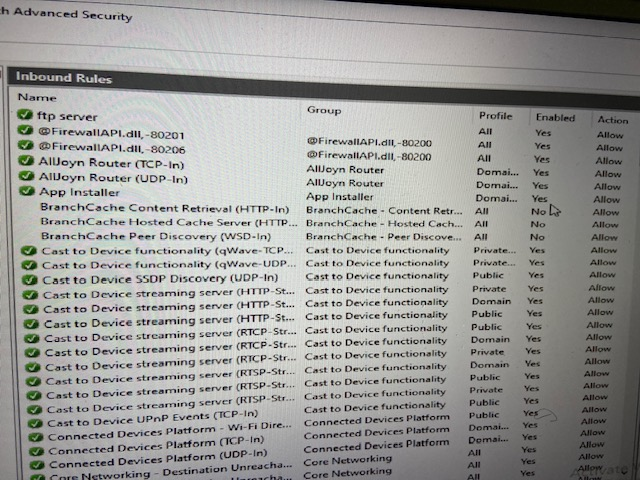

# Windows-Firewall-Config
Configuring Windows Defender Firewall to allow FTP server access within a local network by enabling the firewall, creating inbound rules for port 21 (TCP), and verifying connectivity. Includes steps for securing and managing FTP access.

<!DOCTYPE html>
<html lang="en">
<head>
    <meta charset="UTF-8">
    <meta name="viewport" content="width=device-width, initial-scale=1.0">
   
</head>
<body>

<h1>Configuring Windows Defender Firewall for FTP Server Access</h1>

<h2>📌 Objective</h2>

    This project demonstrates how to configure <strong>Windows Defender Firewall</strong> to allow FTP server connections within a local network.
    We enable the firewall, open <strong>TCP port 21</strong>, and verify FTP connectivity between devices.

<h2>🛠️ Tools Used</h2>
<ul>
    <li><strong>Windows 10</strong></li>
    <li><strong>Windows Defender Firewall</strong></li>
    <li><strong>FileZilla Server</strong></li>
    <li><strong>Oracle VirtualBox</strong></li>
</ul>

<h2>🔹 Steps Taken</h2>

<ol>
    <li>
        <strong>Enable Windows Defender Firewall</strong> 
        - Opened <strong>Windows Defender Firewall settings</strong>. 
        - Turned on the firewall for both <strong>Private</strong> and <strong>Public</strong> networks. 
        <em>(Screenshot 1)</em>
    </li>
    <li>
        <strong>Start Inbound Rule Creation</strong> 
        - Accessed <strong>Windows Defender Firewall with Advanced Security</strong>. 
        - Chose <strong>New Rule → Port</strong> to control traffic based on a port number. 
        <em>(Screenshot 2)</em>
    </li>
    <li>
        <strong>Define FTP Port and Protocol</strong> 
        - Selected <strong>TCP</strong> protocol. 
        - Entered <strong>Specific local port: 21</strong> for FTP traffic. 
        <em>(Screenshot 3)</em>
    </li>
    <li>
        <strong>Set Rule Action and Profiles</strong> 
        - Chose <strong>Allow the connection</strong>. 
        - Applied to <strong>Domain</strong>, <strong>Private</strong>, and <strong>Public</strong> profiles. 
        <em>(Screenshots 4)</em>
    </li>
    <li>
        <strong>Name and Verify the Rule</strong> 
        - Named the rule <strong>FTP Server</strong>. 
        - Verified in the inbound rules list that it was <strong>enabled</strong> and set to <strong>Allow</strong>. 
        <em>(Screenshot 5)</em>
    </li>
</ol>

<h2>📷 Screenshots</h2>
<ol>
    <li></li>
    <li></li>
    <li></li>
    <li></li>
    <li></li>
</ol>

<h2>✅ Outcome</h2>
<ul>
    <li>Successfully enabled <strong>Windows Defender Firewall</strong>.</li>
    <li>Created and activated <strong>inbound firewall rule</strong> for FTP on <strong>port 21</strong>.</li>
    <li>Verified that devices within the local network could connect to the FTP server.</li>
</ul>

<h2>🔐 Security Note</h2>

    While allowing port 21 enables FTP access, it is recommended to use <strong>FTPS (FTP over TLS)</strong> for secure file transfers to prevent credentials from being sent in plain text.

</body>
</html>
